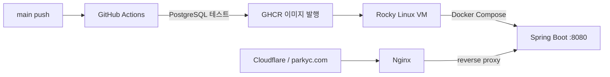

# CI/CD Lab

> Spring Boot Todo 애플리케이션을 Docker 이미지로 만들고, GitHub Actions와 GHCR을 거쳐 Rocky Linux VM에 배포하는 과정을 기록한 실습 프로젝트입니다.

[](https://github.com/PARKyc-dev/cicd-lab/actions)


**배포 주소:** [parkyc.com](https://parkyc.com)

<p align="center">
  <a href="#-실습-목표">실습 목표</a> ·
  <a href="#-배포-흐름">배포 흐름</a> ·
  <a href="#-빠른-시작">빠른 시작</a> ·
  <a href="#-운영-메모">운영 메모</a>
</p>

---

## 🎯 실습 목표

- Spring Boot 애플리케이션과 PostgreSQL을 연결한다.
- Docker 이미지로 애플리케이션을 패키징한다.
- GitHub Actions에서 테스트 후 GHCR에 이미지를 발행한다.
- Rocky Linux VM에서 이미지를 pull하고 Docker Compose로 실행한다.
- Nginx와 Cloudflare를 통해 도메인으로 서비스를 공개한다.

## 🧭 배포 흐름



## 🧰 기술 스택

| 영역 | 사용 기술 |
| --- | --- |
| Application | Java 21, Spring Boot 4, Gradle |
| Persistence | Spring Data JPA, PostgreSQL |
| View | Thymeleaf |
| Container | Docker, Docker Compose |
| CI/CD | GitHub Actions, GitHub Container Registry |
| Infrastructure | Rocky Linux, Nginx, Cloudflare |

---

## 🚀 빠른 시작

### 로컬 실행

로컬 DB 접속 정보는 `src/main/resources/application-local.yaml`에 저장하고 Git으로 관리하지 않습니다.

```bash
./gradlew bootRun
```

<details>
<summary><b>테스트 실행</b></summary>

PostgreSQL이 실행 중인 상태에서 다음 명령을 실행합니다.

```bash
TEST_DB_URL=jdbc:postgresql://localhost:5432/testdb \
TEST_DB_USERNAME=testuser \
TEST_DB_PASSWORD=testpassword \
./gradlew test --no-daemon
```

</details>

### 수동 Docker 배포

CI/CD를 사용하지 않고 직접 이미지를 빌드하고 VM에 배포하는 방법입니다.

<details>
<summary><b>1. 로컬에서 GHCR 이미지 빌드·푸시</b></summary>

Rocky Linux VM을 대상으로 `linux/amd64` 이미지를 빌드합니다.

```bash
docker login ghcr.io -u parkyc-dev
docker build --platform linux/amd64 -t ghcr.io/parkyc-dev/cicd-lab:manual-1 .
docker push ghcr.io/parkyc-dev/cicd-lab:manual-1
```

</details>

<details>
<summary><b>2. VM에서 이미지 pull·실행</b></summary>

VM의 `/opt/cicd-lab/.env`에 DB 접속 정보를 저장합니다. `.env`는 절대 Git에 커밋하지 않습니다.

```dotenv
IMAGE_TAG=manual-1
DB_URL=jdbc:postgresql://<DB_HOST>:5432/<DB_NAME>?sslmode=require
DB_USERNAME=<DB_USERNAME>
DB_PASSWORD=<DB_PASSWORD>
```

```bash
cd /opt/cicd-lab
docker login ghcr.io -u parkyc-dev
docker compose pull
docker compose up -d
docker compose ps
```

</details>

> [!NOTE]
> 앱은 `127.0.0.1:8080`에만 바인딩합니다. 외부 요청은 Nginx가 프록시합니다.

---

## ⚙️ CI/CD 메모

`main` 브랜치에 push하면 GitHub Actions가 아래 순서로 실행됩니다.

1. PostgreSQL 16 서비스 컨테이너를 시작합니다.
2. Gradle 테스트를 실행합니다.
3. GHCR에 `latest`와 커밋 SHA 태그 이미지를 발행합니다.

```text
ghcr.io/parkyc-dev/cicd-lab:latest
ghcr.io/parkyc-dev/cicd-lab:<commit-sha>
```

<details>
<summary><b>GHCR 권한에서 확인할 점</b></summary>

워크플로는 `GITHUB_TOKEN`과 `packages: write` 권한으로 이미지를 발행합니다.

수동으로 먼저 만든 GHCR 패키지는 저장소와 연결되지 않을 수 있습니다. 이 경우 GitHub의 **Packages → cicd-lab → Package settings**에서 `PARKyc-dev/cicd-lab` 저장소를 연결하고, 필요하면 **Manage Actions access**에 같은 저장소를 추가합니다.

</details>

---

## 🛠 운영 메모

<details>
<summary><b>Nginx 리버스 프록시</b></summary>

```nginx
location / {
    proxy_pass http://127.0.0.1:8080;
    proxy_http_version 1.1;
    proxy_set_header Host $host;
    proxy_set_header X-Real-IP $remote_addr;
    proxy_set_header X-Forwarded-For $proxy_add_x_forwarded_for;
    proxy_set_header X-Forwarded-Proto $scheme;
}
```

Rocky Linux에서 SELinux가 활성화되어 있다면 Nginx의 프록시 연결을 허용합니다.

```bash
sudo setsebool -P httpd_can_network_connect 1
sudo nginx -t
sudo systemctl reload nginx
```

</details>

<details>
<summary><b>상태 확인</b></summary>

```bash
docker compose ps
docker compose logs --tail=100 app
curl http://127.0.0.1:8080/api/db/health
curl -ks https://parkyc.com/api/db/health
```

</details>

<details>
<summary><b>메모리 제한</b></summary>

VM의 `compose.yaml`에 컨테이너와 JVM 힙 한도를 함께 설정할 수 있습니다.

```yaml
mem_limit: 512m
memswap_limit: 512m
environment:
  JAVA_TOOL_OPTIONS: "-Xms128m -Xmx320m"
```

`-Xmx`는 컨테이너 한도보다 작게 설정해 Metaspace·스레드 스택 등 JVM의 힙 외 메모리를 위한 여유를 남깁니다.

</details>

---

## 📌 다음에 확인할 것

- [ ] GHCR 패키지와 GitHub 저장소 연결 상태 확인
- [ ] GitHub Actions 이미지 발행 성공 확인
- [ ] VM에서 커밋 SHA 태그로 배포 및 롤백 연습
- [ ] 컨테이너 메모리 사용량 측정 후 한도 조정

<p align="center">
  <sub>CI/CD 흐름을 직접 구축하고 운영하며 기록하는 실습 프로젝트</sub>
</p>
